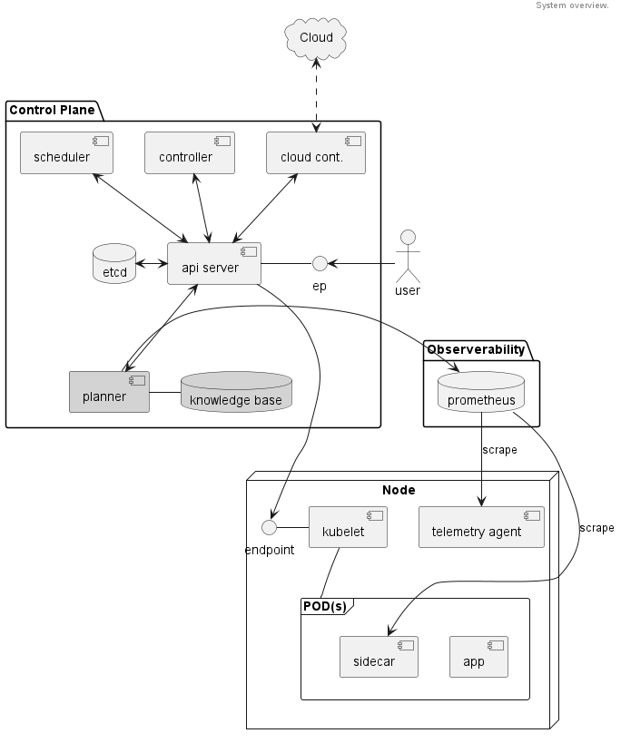
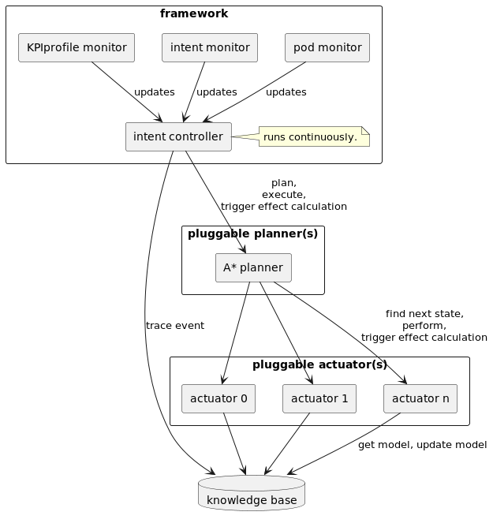

# Design Document

## Motivation

* Enable ease-of-use for service owners when deploying their services and make optimal use cluster
  infrastructure capabilities.
* Avoid the need to establish the resource requirements needed to support particular workload objectives.
* Avoid the need to adjust resource requirements when the state of the cluster changes, or the instance types
  underpinning the cluster changes.
* Demonstrate that objective based deployments can leverage the investments in the Kubernetes scheduling and
  resource orchestration functions.

**_Metric_**: Showcase the benefit of Intent Driven Orchestration systems over static, imperatively declared
  models.

## Functional Description

* Goal is to showcase a full-stack system for managing QoS/SLO of services deployed using Kubernetes.
* Enable a cluster level planning component that effectively leverages the node level resources.
* Use planning component for
    * a) an Intent Driven Orchestration approach using SLOs and
    * b) showcase ease of use & continuous monitoring of services.
* Integration with an observability framework.
* Planner and scheduler should work in unison. Better/more accurate requirements for the scheduler leads to better 
  placement.
* Adhere to Kubernetes design philosophies - e.g. ground truth of object properties/states is stored in etcd.
* Initially, IDO will look into PODs - not necessarily individual containers - albeit that is a desirable feature to
  add.
* Scalability - aiming to support Kubernetes deployments with ~5000 nodes with ~200,000 PODs;
  See [this](https://medium.com/paypal-tech/scaling-kubernetes-to-over-4k-nodes-and-200k-pods-29988fad6ed) link for
  reference.

## Constraints / Limitations

* Workload characterization - currently IDO will need an experimental phase to learn insights that are put in the
  knowledge base. To not need exhaustive experimentation IDO can use [SigOpt](https://sigopt.com/),
  [Granulate](https://granulate.io/), [StormForge](https://www.stormforge.io/), [optuna](https://optuna.org/), or
  similar tools.
    * IDO can build this out to support “learning at runtime”.
* Adoption patterns - currently IDO focuses on CRD for objectives usage, with the potential for future use of
  annotations in the POD specs.

## System Architecture

The following sections detail some design decisions for the initial implementation after the tradeoff analysis.

### Stakeholders

* _Service Owner_ – motivated by best performance per $$$ (or Watt etc.) & SLO compliance. Will set the objectives for
  her/his set of workload instance
* _Cluster/Resource Admin (aka admin)_ – motivated by best Return on Investment (ROI) over its resources; Will set
  the guardrails in which to operate -  e.g. favor high priority over low priority; Can leverage
  Multi-Attribute-Utility-Theory (MAUT).

### System Diagram

The following diagram shows how the planner is embedded into the overall system.

### Building blocks & Interfaces

The following diagram details the internals of the planning component.

### Data Structures

For now a [MongoDB](https://mongodb.org) based knowledge base is being used. The following collections are being used.

#### Effects collection

The effect of tuning on a workload can be stored in the following format. The “static” flag indicates whether
this model is continuously updating or static:

    {
      "name": "<identifier>",
      "group": "<name>",
      "profileName": ...
      "data": {
        <can contain arbitrary data as a map; the key "model" should be used to store the actual pickled model>
      },
      "static": true,
      "timestamp": ""
    }

#### Events collection

Each time the intent controller is triggered, an event is being traces in the following format:

    {
      "name": "<identifier>",
      "current_objectives": "<map with currently tracked objectives.>",
      "desired_objectives": "<map with desired objectives.>",
      "pods": "<map with per pod information.>",
      "data": "<addiontion infomration on e.g. the platform - telemetry data on node load.>",
      "plan": "<list of actions determined by the planner.>",
      "timestamp": ""
    }

### Pluggability Requirements

* The system shall support the admin to replace the planning algorithm with their own.
* The system might support the admin to configure multiple planning algorithms to be run at the same time (could be done
  per namespace).
* The system shall support the admin to enable or disable actuators that they want to support in the cluster.
* The system shall support the admin to support actuators which are specific/adaopted to their environment.

For more information have a look [here](pluggability.md).
