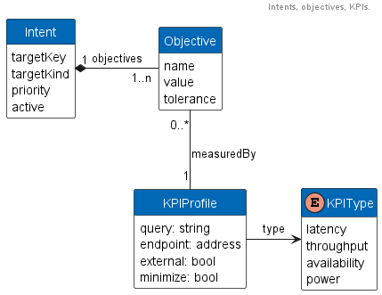

# Intent Management Framework

The overall Intent Management Framework roughly follows the concept of a Kubernetes operator. Using Custom Resource
Definitions (CRDs) the control plane is extended to support two key kinds:

* Intent - enabling users define intents for their workload
  [resources](https://kubernetes.io/docs/concepts/workloads/).
* KPIProfile - enabling users to use pre-configured or define profiles that inform the control plane how to
  measure SLOs/KPIs.

The CRD can be found [here](../artefacts/intents_crds_v1alpha1.yaml). An overview of the kinds can be seen in the
following diagram:

A user can define an intent for a workload resource that consists of 1 to N objectives. The initial implementation
limits the number of objectives to 5. The objectives are associated with one KPIProfile which tells the planner the
kind of the objective (i.e. SLO) and how to measure it.

## Intent Controller

The implementation of the Intent Controller can be found in
[_intent_controller.go_](../pkg/controller/intent_controller.go)

The Intent Controller will continuously compare the current state of a workload (as defined by its current objectives)
to the desired state. This is done on either at a regular interval or from an event trigger in the system. The Intent
Controller uses state definition to describe the current and desired objectives and will use the same to trigger the
actual planner.

States encapsulate the following information:

* Name of the intent.
* Name of the workload resource associated with this intent.
* Kind of the workload resource associated with this intent.
* A priority.
* Map of objectives with their name and current/desired value.
* Map of PodStates describing the PODs making up the workload resource.
* Map of data with e.g. telemetry information so the planner can make informed decisions.

See the [_state_helper.go_](../pkg/controller/state_helper.go) and [_types.go_](../pkg/common/types.go) for the actual
implementations details.

Once the current and desired state are determined the Intent Controller will trigger the planner, followed by the
execution of a plan (if a plan could be determined), trace the things it did, and finally trigger the planner to
re-evaluate how it did.

## Monitoring Intents

[_intent_monitor.go_](../pkg/controller/intent_monitor.go) implements the controller for the Intent kind. If
an intent is added, removed or modified the monitor will construct the necessary data types and inform the Intent
Controller.

In case an intent changes, the Intent Controller will trigger a re-evaluation of all objectives to assure
cross-objectives goals are met.

## Monitoring KPI Profiles

[_kpi_profile_monitor.go_](../pkg/controller/profile_monitor.go) implements the controller for the KPIProfile kind.
It looks for profiles currently defined in the control plane and either matches them to a configuration file defining
the queries for pre-defined profiles, or assures the profile has the necessary information for the intent framework to
query the observability stack. If a profile is understood by the overall system, it's state is set to resolved.

In case a Profile changes, the intent controller will trigger a re-evaluation of all objectives.

## Monitoring PODs

[_pod_monitor.go_](../pkg/controller/pod_monitor.go) implements a monitor that watch for POD changes. For PODs in the
system it will track their Errors and hence enable IDO to track objectives such as availability.

In case a POD reports an error, the Intent Controller will trigger a re-evaluation of all objectives. This enables
IDO to quickly react to many types of failures.
